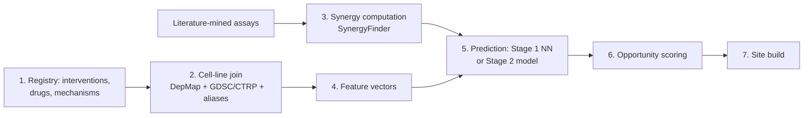

# NPxP Interaction Predictor & Opportunity Ranking — Build Spec

Sep 22, 2026 · @Someone

## 1. Purpose and scope

This module extends NPxP (Non-Pharm × Pharm) from a synergy-ranking resource into a queryable predictor: given any (non-pharm intervention, pharmacological therapy, cell line) triple, return a predicted interaction — synergy, additivity, or antagonism — with its evidence basis, plus a ranked view of which cell lines and cancer types have the most to gain from adding a non-pharm intervention to standard therapy.

**Two entry points, one underlying model**

1. **Interaction lookup.** Pick a non-pharm intervention, a drug, and a cell line (or cancer type) → get a predicted interaction score, its evidence tier, and — when the prediction isn't from direct data — the basis for the extrapolation (which similar cell lines or mechanisms it's drawn from).
2. **Opportunity ranking.** Given a cell line or cancer type, or across all of them → which ones show the largest predicted benefit from adding non-pharm interventions to their standard-of-care drugs, and which non-pharm interventions drive that.

Both read from the same interaction model (section 5); the lookup is a point query, the ranking is an aggregation over it.

**In scope (MVP)**

- A defined registry of non-pharm interventions (ketogenic diet, therapeutic fasting/caloric restriction, hyperthermia, exercise, hyperbaric oxygen, cold exposure — extensible) and their mechanism annotations.
- Empirical synergy scores computed from literature-mined dose-response combination data, using standard reference models.
- A transparent, similarity-based prediction layer for untested triples (section 5), with an explicit path to a learned model once enough data exists.
- Cell-line and cancer-type opportunity scores built from the same predictions.

**Non-goals**

- No clinical dosing or treatment recommendations — this predicts a cell-line-level interaction direction and magnitude, not a patient outcome.
- No claim that a cell-line finding translates to in vivo or clinical efficacy without the usual caveats; every prediction states its evidence tier so this distinction stays visible.
- No re-hosting of GDSC/CTRP/DepMap bulk data beyond what's needed for the join; the module links back to source records.

**Fit with NPxP.** This is the query/prediction layer sitting on top of the ranking model already scoped for npxp.opensourcemed.info (mixed-effects ranking of non-pharm main effects). It reuses that ranking's synergy computation and mechanism taxonomy, and follows the evidence-tier and static-site conventions already used in the Genetic Correlates Explorer and PAIS cohort database.

## 2. Evidence and confidence tiers

Every returned interaction — empirical or predicted — carries one tier. The UI never presents a prediction with the same visual weight as a direct measurement.

| Tier | Code | Definition | How it's produced |
| --- | --- | --- | --- |
| Direct empirical | E1 | A dose-response combination assay exists for this exact (non-pharm, drug, cell line) triple | Literature-mined data, synergy score computed directly (section 5) |
| Mechanistic extrapolation | E2 | No direct assay, but a molecularly similar cell line (by DepMap features) has been tested with the same non-pharm mechanism and a drug of the same MoA class | Nearest-neighbor lookup with a stated similarity basis |
| Model-predicted | E3 | No direct or near-neighbor data; the score comes from the fitted interaction model's extrapolation over intervention, drug and cell-line features | Regression/ML output (post-MVP; see section 5) |
| Insufficient data | E0 | Neither the intervention, the drug, nor the cell line's family has enough related data to support even an E2 estimate | Returned explicitly rather than silently omitted |

**Quality flags carried alongside every E1 record:** synergy model used (Bliss/Loewe/HSA/ZIP), dose range tested, replicate count, cell-line passage/source notes when reported, and whether the result has been independently replicated in a second study.

**Direction and magnitude.** A score alone is not the whole answer — every result states direction (synergistic / additive / antagonistic) and, for E1, the dose range over which that holds, since synergy is frequently dose-dependent and can flip sign across a dose-response surface (this is why a single scalar per pair is not stored — see the synergy-surface fields in section 4).

**Antagonism is a first-class result.** A non-pharm intervention that reduces a drug's efficacy in a given cell line is exactly the kind of finding this tool exists to surface, not a null result to be dropped.

## 3. Data sources

There is no clean public dataset of "non-pharm × drug × cell line" combination assays — that layer is built by literature mining. Cell-line features and single-agent drug sensitivity, by contrast, have mature public resources, verified current as of this build.

| Source | Provides | Access | Notes |
| --- | --- | --- | --- |
| DepMap (Broad, 26Q1) | Cell-line metadata, mutations, CN, expression, CRISPR dependency | REST API (`depmap.org/portal/api`) + bulk download | \~1,000+ cell lines; use `Models.csv` for Oncotree lineage/subtype mapping |
| GDSC (Sanger) | Single-agent drug sensitivity (IC50, AUC) across >1,000 cell lines, 265+ drugs | Bulk download only | Confirmed not available via the DepMap API — pull separately and join on cell-line identifiers, which need reconciliation (GDSC COSMIC IDs vs. DepMap ModelIDs) |
| CTRP (CTD2) | Independent drug sensitivity screen, different cell-line/drug overlap than GDSC | Bulk download | Useful as a replication check where it overlaps GDSC |
| Literature (PubMed/Europe PMC) | Non-pharm × drug combination assays: dose-response data, cell line, readout | Manual/semi-automated extraction | Primary source for the E1 layer; expect low throughput — this is the bottleneck, not the compute |
| Mechanism taxonomies | Non-pharm intervention → biological mechanism (e.g., ketogenic diet → glycolysis restriction; hyperthermia → HSP modulation/DNA-repair impairment); drug → MoA/target pathway (ChEMBL/DrugBank) | Curated + bulk download | Backbone of the E2 similarity model |
| SynergyFinder (R, `synergyfinder` v3.21) | Bliss/Loewe/HSA/ZIP computation, dose-surface fitting, synergy barometer | Bioconductor package | Computes tiered synergy scores from ingested dose-response matrices; no need to reimplement the math |

**Cell-line identity reconciliation** is a real integration cost: DepMap, GDSC, CTRP and individual papers each use different cell-line naming and identifiers. A `cell_line_aliases` table mapping to a canonical DepMap ModelID (via Cellosaurus IDs where available) is a first-class MVP deliverable, not an afterthought — every downstream join depends on it.

## 4. Data model

The unit of record is the dose-response combination assay; synergy scores and predictions are derived views over it. CSV for curated tables, Parquet for derived ones, JSON Schema validated in CI, loaded into DuckDB for builds.

| Table | Primary key | Required fields |
| --- | --- | --- |
| `interventions` | `intervention_id` | name, class (pharm/non-pharm), mechanism\_id(s), dose parameter schema (e.g., keto = % kcal from fat; hyperthermia = °C × minutes) |
| `mechanisms` | `mechanism_id` | label, pathway/process description, source citation |
| `drugs` | `drug_id` (ChEMBL/DrugBank ID) | name, MoA, target pathway, drug class |
| `cell_lines` | `depmap_model_id` | CCLE name, Oncotree lineage/subtype, tissue, key mutation flags, source\_dataset |
| `cell_line_aliases` | (`source`, `source_id`) | maps GDSC COSMIC ID / CTRP master CCL ID / paper-reported name to `depmap_model_id` |
| `cell_line_features` | `depmap_model_id` | curated feature vector used for similarity: mutation status of key genes, expression of metabolic markers, baseline single-agent sensitivity profile |
| `assays` | `assay_id` | intervention\_id(s), drug\_id, depmap\_model\_id, dose matrix, readout type (viability/apoptosis/IC50 shift), publication\_id, source\_id |
| `synergy_scores` | `score_id` | assay\_id, model (Bliss/Loewe/HSA/ZIP), score value(s) across the dose surface, direction, dose range of effect, replicated flag |
| `predicted_interactions` | (intervention\_id, drug\_id, depmap\_model\_id) | tier (E0 to E3), predicted score, basis (nearest-neighbor IDs or model version), confidence interval |
| `cell_line_opportunity_scores` | `depmap_model_id` | aggregate predicted uplift, evidence density, top contributing non-pharm interventions |
| `cancer_type_opportunity_scores` | `oncotree_code` | rollup of cell-line scores, cell-line count backing it |
| `publications` | `publication_id` (PMID/DOI) | title, year, journal |
| `sources` | `source_id` | name, release/version, URL, licence, retrieved\_at |
| `curation_log` | `entry_id` | record changed, curator, date, reason |

**Why a dose surface, not a scalar.** `synergy_scores` stores the score across the tested dose range (or a small set of representative points), not a single number per assay — a combination can be synergistic at low dose and antagonistic at high dose, and collapsing that to one value would misrepresent the assay. Lookup results always show the range they're valid over.

## 5. Prediction methodology

Two stages, deliberately sequenced: a transparent similarity model first, a learned model only once there's enough E1 data to validate one honestly. Shipping a black-box model on a few dozen assays would produce confident-looking predictions with no real basis — the similarity model is the more defensible MVP, not a placeholder.

### Stage 1 (MVP): mechanism-and-feature similarity

For a queried (non-pharm, drug, cell\_line) triple with no direct assay:

1. Find cell lines with an E1 assay for the *same non-pharm intervention* (or same mechanism\_id) and a drug of the *same MoA class*.
2. Rank those by cell-line similarity to the query cell line, using a feature distance over `cell_line_features` (mutation profile overlap, tissue/lineage match, relevant pathway expression — e.g., glycolytic gene expression for a ketogenic-diet query).
3. Return a weighted average of the k nearest matches (k default 3–5, fewer if fewer exist) as the E2 prediction, weighted by similarity and by each source assay's replicate count.
4. If no same-mechanism/same-MoA-class assay exists anywhere, return E0 explicitly — not a guess.

Every E2 result names its nearest neighbors and the similarity basis, so a user can judge the extrapolation themselves rather than trust a hidden score.

### Stage 2 (post-M2): fitted interaction model

Once the assay count supports it (rule of thumb: enough E1 data to hold out entire cell lines and drugs for validation, not just individual assays), fit a regularized model — gradient-boosted trees or elastic-net regression, not deep learning, given realistic literature-scale N — predicting synergy score from:

- Non-pharm mechanism category and dose parameters
- Drug MoA/target pathway and dose
- Cell-line features (mutation status, expression, lineage)
- Interaction terms between non-pharm mechanism and cell-line features flagged as mechanistically relevant (e.g., glycolytic dependency × metabolic-restriction interventions)

**Validation:** leave-one-cell-line-out and leave-one-drug-out cross-validation, reported separately — a model that only interpolates within seen cell lines/drugs is not actually predictive for the lookup tool's main use case (querying untested triples). Report calibration (predicted vs. observed synergy) alongside accuracy; a well-calibrated but modest model is more useful here than an uncalibrated strong one.

**Explainability.** Every E3 prediction ships with per-feature contributions (e.g., SHAP values) so "why is this predicted to synergize" has an answer beyond "the model said so" — this matters for a research tool whose entire purpose is generating testable hypotheses, not asserting truths.

**Model versioning.** `predicted_interactions.basis` records the exact model version (or, for E2, the neighbor set) behind every stored prediction, so a later model update doesn't silently change historical results without a visible diff.

## 6. Cell-line and cancer-type opportunity scoring

The goal is to answer "where should a non-pharm-plus-drug study happen next" — which means the score has to reward genuine predicted upside, not just wherever the most non-pharm data already happens to sit.

**Per cell line**, the opportunity score combines two things that pull in different directions:

- **Predicted uplift** — the best predicted or observed synergy score across all tested/predicted non-pharm interventions paired with that cell line's relevant standard-of-care drugs (drug relevance comes from the cell line's Oncotree cancer type and its documented first-line/second-line agents).
- **Evidence gap** — how few non-pharm combinations have actually been tested for this cell line or its close neighbors. A cell line with a strong *predicted* uplift but almost no direct testing scores higher on "worth investigating" than one with the same predicted uplift but already well-studied.

```
opportunity_score = predicted_uplift × gap_weight
gap_weight = 1 / (1 + log(1 + e1_assay_count_for_this_cell_line_or_neighbors))
```

This is a prioritization heuristic, not a validated metric — it's reported alongside its two components so a user can re-weight by their own criteria (e.g., ignore the gap term and just rank by raw predicted uplift).

**Per cancer type**, roll up the cell-line scores: mean and max opportunity score across the cell lines mapped to that Oncotree code, plus the count of cell lines backing the estimate (a cancer type represented by one cell line gets flagged as low-confidence, not hidden).

**What "benefit" means here is explicit.** The score is about *predicted in-vitro synergy with standard-of-care agents*, not clinical outcome improvement, treatment-resistance reversal, or survival — each of which would need its own (much larger) evidence base. The ranking page states this in the same breath as the numbers, not in a separate disclaimer section.

**Drug-relevance mapping.** `drugs` need a `standard_of_care_for` field (Oncotree codes) sourced from NCCN/oncology-reference mappings so the opportunity score only considers clinically relevant drug pairings for that cancer type, not every drug in the database indiscriminately.

## 7. Pipeline architecture

Extends the `npxp` package (github.com/MattH55/npxp) with modules that build on the existing ranking pipeline rather than replacing it.



| Module | Input | Output | Key logic |
| --- | --- | --- | --- |
| 1. Registry | curated YAML | `interventions`, `drugs`, `mechanisms` | Validates mechanism references resolve |
| 2. Cell-line join | DepMap bulk files, GDSC/CTRP bulk files, curated aliases | `cell_lines`, `cell_line_aliases` | Reconciles identifiers to a canonical DepMap ModelID; fails loudly on an unresolvable alias rather than dropping the row |
| 3. Synergy computation | ingested dose-response matrices from literature extraction | `assays`, `synergy_scores` | Runs SynergyFinder (Bliss/Loewe/HSA/ZIP) per assay; flags dose-dependent sign changes |
| 4. Feature vectors | DepMap omics | `cell_line_features` | Curated subset relevant to non-pharm mechanisms (metabolic, stress-response, DNA-repair pathway genes), not the full omics dump |
| 5. Prediction | synergy\_scores, cell\_line\_features, mechanisms | `predicted_interactions` | Stage 1 nearest-neighbor by default; Stage 2 model swapped in once validated (section 5) |
| 6. Opportunity scoring | predicted\_interactions, standard\_of\_care mapping | `cell_line_opportunity_scores`, `cancer_type_opportunity_scores` | Formula in section 6 |
| 7. Site build | DuckDB | static HTML/JSON, lookup index, CSV downloads | Jinja templates; client-side search for the lookup tool |

**CI and release.** Schema validation and referential-integrity checks on every PR; a fixed-fixture test suite for the synergy computation and Stage 1 nearest-neighbor logic so a code change can't silently shift results; Stage 2 model changes require the leave-one-out validation report to accompany the PR, not just pass CI silently.

## 8. Site pages

Five page types under npxp.opensourcemed.info, static HTML with embedded JSON, matching the rest of the OSMF portfolio.

| Page | URL pattern | Contents |
| --- | --- | --- |
| Lookup | `/lookup.html` | Three-field search (non-pharm, drug, cell line/cancer type); returns the interaction result — tier, score, direction, dose range, and for E2/E3 the basis (neighbors or feature contributions) |
| Interaction detail | `/interaction/{intervention_id}/{drug_id}/{depmap_model_id}.html` | Full record: dose-response surface plot, synergy model comparison (Bliss/Loewe/HSA/ZIP side by side), source citation or prediction basis |
| Cell-line opportunity | `/opportunity/cell-lines.html` | Sortable table: cell line, cancer type, opportunity score, predicted-uplift component, evidence-gap component, top contributing non-pharm interventions |
| Cancer-type opportunity | `/opportunity/cancer-types.html` | Rollup view: mean/max opportunity score per Oncotree code, cell-line count backing it, link to the cell lines beneath |
| Non-pharm leaderboard | `/leaderboard.html` | The main-effect ranking from the mixed-effects model (the original NPxP ask) — which non-pharm interventions potentiate therapy most broadly, with evidence-count and CI |

**UI rules**

- Every result shows its tier as a text label (E1/E2/E3/E0), never color alone; E2/E3 always show "why" in one line before any number.
- The lookup accepts a cancer type as well as a specific cell line, in which case it returns the best-evidenced cell line within that type plus a note that results vary within a cancer type.
- A persistent footer states this is a cell-line-level in-vitro research tool, not clinical guidance, mirroring the framing used elsewhere in the OSMF portfolio.
- Every table has CSV download and a citation string for the data release.

## 9. Provenance, licensing and framing

**Licensing.** DepMap data are freely available for research use under its stated terms; GDSC and CTRP are similarly free for academic/research use — the `sources` table records the exact release and licence per upstream source, since terms can differ by dataset within the same portal.

**Framing requirements**

- Language stays at "predicted interaction" and "in-vitro synergy," never "treatment" or "improves outcomes" — the whole tool operates one step removed from anything clinical, and the copy should reflect that consistently, not just in a disclaimer block.
- E2/E3 results are visually and textually distinct from E1 — a predicted score should never be mistaken for a measured one at a glance.
- The opportunity ranking is framed as "where research is most worth doing," not "where non-pharm interventions work best" — it is a prioritization tool for investigators, not a claim about real-world efficacy.
- Methods page documents the synergy models, the Stage 1/Stage 2 prediction approach, and the opportunity-score formula, versioned with each release, matching the transparency standard set in the Genetic Correlates Explorer.

**Corrections.** Errors and disputed extractions are reported via GitHub issue, fixed by PR, and appear in the release diff and `curation_log`, consistent with the rest of the OSMF research-tool portfolio.

## 10. Milestones and acceptance criteria

| Milestone | Deliverable | Done when |
| --- | --- | --- |
| M0 Foundations | Schema, CI, registry, cell-line identity reconciliation | `cell_line_aliases` resolves a test set of GDSC/CTRP/paper-reported names to DepMap ModelIDs with zero unresolved entries; CI rejects malformed fixtures |
| M1 First E1 vertical slice | Literature-extracted assays for one non-pharm intervention (e.g., ketogenic diet) × 2–3 drugs across available cell lines; synergy computed via SynergyFinder | Every assay reproduces its source paper's reported direction (synergy/antagonism); dose-surface data stored, not collapsed to a scalar |
| M2 Stage 1 prediction | Nearest-neighbor E2 model live; E0 returned correctly where no basis exists | A held-out E1 assay, when queried as if untested, gets an E2 prediction within a defined error tolerance of the real value in a majority of held-out cases |
| M3 Full registry | All planned non-pharm interventions ingested; cell-line feature vectors built | Lookup returns a non-E0 result for at least one drug per major cancer type in the registry |
| M4 Opportunity scoring + lookup site | Modules 6–7; all five site pages live | Cell-line and cancer-type leaderboards populate; a manual spot-check of 10 opportunity scores confirms the formula's two components are computed correctly |
| M5 (stretch) Stage 2 model | Regression/GBM model replacing Stage 1 where validated | Leave-one-cell-line-out and leave-one-drug-out validation reports published; model only ships if it beats Stage 1 on held-out error, not merely on training fit |

**Public launch** follows M4; M5 ships as a dated update once earned, not on a fixed timeline.

## 11. Open questions

- [ ] Which non-pharm interventions go in the initial registry beyond keto/fasting/hyperthermia/exercise/HBOT — cold exposure, circadian/light interventions, others?
- [ ] Who does the literature extraction — manual curation, an LLM-assisted extraction pass with human review, or a mix? This is the actual throughput bottleneck for E1 data.
- [ ] Should `drugs.standard_of_care_for` be curated by hand per cancer type, or pulled from an existing structured source (NCCN guidelines aren't machine-readable; is there a usable proxy)?
- [ ] What error tolerance counts as "validated" for the M2 nearest-neighbor check, given the small likely N?
- [ ] Does this module live at npxp.opensourcemed.info as planned, or fold into research.opensourcemed.info alongside the Genetic Correlates Explorer for a single research-tools entry point?
- [ ] Should antagonistic findings get any special surfacing (e.g., a standalone "interactions to avoid" view) given their direct relevance to anyone combining these approaches in practice?

## Sources

- [DepMap Portal](https://depmap.org/)
- [GDSC / Cell Model Passports — drug sensitivity access](https://depmap.sanger.ac.uk/documentation/gdsc/)
- [SynergyFinder (Bioconductor)](https://bioc-release.r-universe.dev/synergyfinder)
- [ToolUniverse — drug-combination synergy reference models](https://tessl.io/registry/skills/github/mims-harvard/ToolUniverse/tooluniverse-drug-synergy--tooluniverse-drug-synergy)
